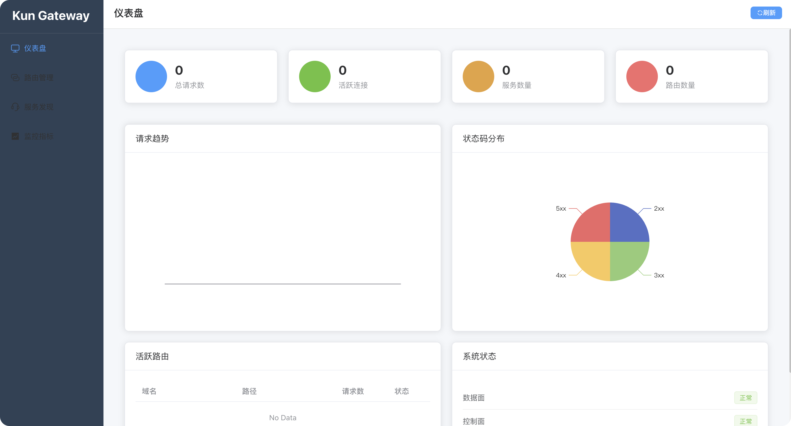
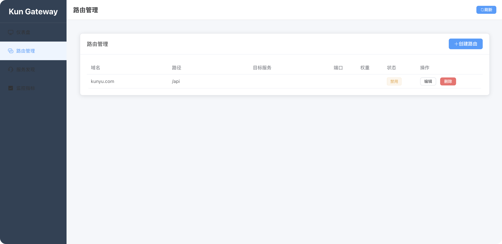
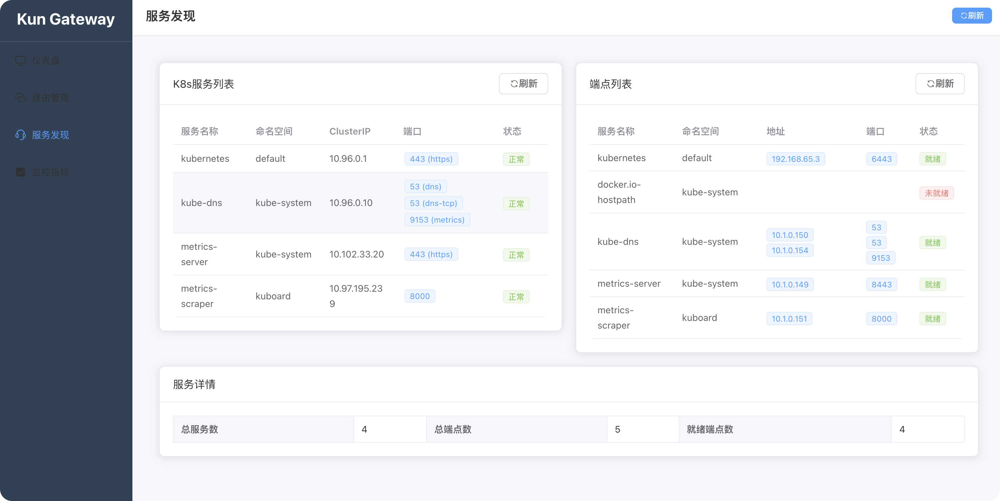

# Kun Gateway

一个基于Golang+Vue的云原生K8s流量网关系统，严格分离数据面（Data Plane）与控制面（Control Plane）。

## 系统架构

```
┌───────────────┐       ┌───────────────┐
│  Control Plane│◄───►│  Data Plane   │
│  (Vue3+Go API)│  配置同步  │(Go 流量代理)  │
└───────────────┘       └───────────────┘
        ▲                     ▲
        │监控数据              │监听80端口(hostNetwork)
┌──────┴──────┐       ┌──────┴──────┐
│K8s API Server│       │  集群流量     │
└──────────────┘       └──────────────┘
```

## 界面展示

### 仪表盘


仪表盘页面提供系统整体运行状态的概览，包括：
- 实时请求统计和性能指标
- 系统健康状态监控
- 关键业务指标展示
- 快速访问常用功能

### 路由管理


路由管理页面支持动态配置流量路由规则：
- 可视化路由规则配置
- 支持域名、路径、Header匹配
- 权重分配和负载均衡设置
- 实时路由规则生效状态

### 服务发现


服务发现页面自动展示K8s集群中的服务信息：
- 自动发现K8s Service和Endpoint
- 实时显示服务端口和端点地址
- 服务健康状态监控
- 支持服务筛选和搜索

## 核心特性

### 数据面（Data Plane）
- **高性能代理**: 使用fasthttp实现高并发转发
- **动态路由**: 支持域名+路径路由，Header路由，权重分配
- **原子更新**: 使用atomic.Value实现零中断配置更新
- **监控指标**: 实时记录请求数、延迟、状态码等指标
- **hostNetwork模式**: 监听宿主机80端口，支持DaemonSet部署

### 控制面（Control Plane）
- **K8s服务发现**: 自动监听Service和Endpoint变化
- **可视化配置**: Vue3+Element Plus提供友好的Web界面
- **实时监控**: 图表展示系统运行状态和性能指标
- **配置管理**: 支持路由规则的增删改查

### 关键技术
- **零中断更新**: 双路由表原子切换，避免Nginx式Reload
- **自动发现**: 监听K8s API，实时获取Service和Pod信息
- **负载均衡**: 支持轮询、权重、最小连接等策略
- **健康检查**: 自动过滤不健康的Pod端点

## 快速开始

### 1. 本地开发

```bash
# 克隆项目
git clone <repository-url>
cd kun-gateway

# 安装Go依赖
go mod download

# 构建二进制文件
make build

# 启动数据面（需要sudo权限监听80端口）
sudo make run-dataplane

# 启动控制面
make run-controlplane

# 安装前端依赖
make install-frontend

# 启动前端
make run-frontend
```

### 2. Docker部署

```bash
# 构建Docker镜像
make docker-build

# 推送镜像
make docker-push

# 部署到K8s
make deploy
```

### 3. K8s部署

```bash
# 应用部署文件
kubectl apply -f deployments/

# 查看部署状态
kubectl get pods -n kube-system -l app=kun-gateway

# 查看服务
kubectl get svc -n kube-system -l app=kun-gateway
```

## 配置说明

### 数据面配置

```bash
./dataplane --port=80 --api-port=8080 --log-level=info
```

参数说明：
- `--port`: 代理服务器监听端口（默认80）
- `--api-port`: API服务器监听端口（默认8080）
- `--log-level`: 日志级别（debug/info/warn/error）

### 控制面配置

```bash
./controlplane --port=9090 --dataplane-url=http://localhost:8080 --log-level=info
```

参数说明：
- `--port`: 控制面API监听端口（默认9090）
- `--dataplane-url`: 数据面API地址
- `--log-level`: 日志级别

## API接口

### 数据面API

- `GET /api/v1/health` - 健康检查
- `GET /api/v1/routes` - 获取路由规则
- `PUT /api/v1/routes` - 更新路由规则
- `GET /api/v1/metrics` - 获取监控指标

### 控制面API

- `GET /api/v1/health` - 健康检查
- `GET /api/v1/routes` - 获取路由配置
- `POST /api/v1/routes` - 创建路由
- `PUT /api/v1/routes/:id` - 更新路由
- `DELETE /api/v1/routes/:id` - 删除路由
- `GET /api/v1/services` - 获取K8s服务
- `GET /api/v1/endpoints` - 获取K8s端点
- `GET /api/v1/metrics` - 获取监控数据

## 路由配置示例

```json
{
  "domain": "example.com",
  "path": "/api",
  "headers": {
    "X-Group": "canary"
  },
  "service": "default/myapp",
  "port": 8080,
  "weight": 100,
  "enabled": true
}
```

## 监控指标

系统提供以下监控指标：

- **基础指标**: 总请求数、活跃连接数、响应时间
- **状态码分布**: 2xx/3xx/4xx/5xx状态码统计
- **域名维度**: 按域名统计请求量、成功率、延迟
- **上游健康**: 后端服务健康状态监控

## 性能指标

- **配置更新延迟**: ≤1秒
- **百万并发连接**: 内存占用 <500MB
- **灰度发布精度**: Header触发路由比例误差 <5%

## 开发指南

### 项目结构

```
kun-gateway/
├── cmd/                    # 主程序入口
│   ├── dataplane/         # 数据面主程序
│   └── controlplane/      # 控制面主程序
├── pkg/                   # 核心包
│   ├── dataplane/         # 数据面组件
│   ├── controlplane/      # 控制面组件
│   └── common/            # 公共组件
├── web/frontend/          # Vue3前端
├── deployments/           # K8s部署文件
├── configs/               # 配置文件
└── Makefile              # 构建脚本
```

### 开发命令

```bash
# 代码格式化
make fmt

# 代码检查
make lint

# 运行测试
make test

# 更新依赖
make deps

# 查看帮助
make help
```

## 故障排查

### 常见问题

1. **端口被占用**
   ```bash
   # 检查端口占用
   sudo lsof -i :80
   sudo lsof -i :8080
   ```

2. **K8s权限问题**
   ```bash
   # 检查RBAC配置
   kubectl get clusterrolebinding | grep kun-gateway
   ```

3. **数据面无法启动**
   ```bash
   # 检查日志
   kubectl logs -n kube-system -l app=kun-gateway,component=dataplane
   ```

## 贡献指南

1. Fork项目
2. 创建特性分支
3. 提交更改
4. 推送到分支
5. 创建Pull Request

## 许可证

MIT License

## 联系方式

如有问题或建议，请提交Issue或联系维护者。 